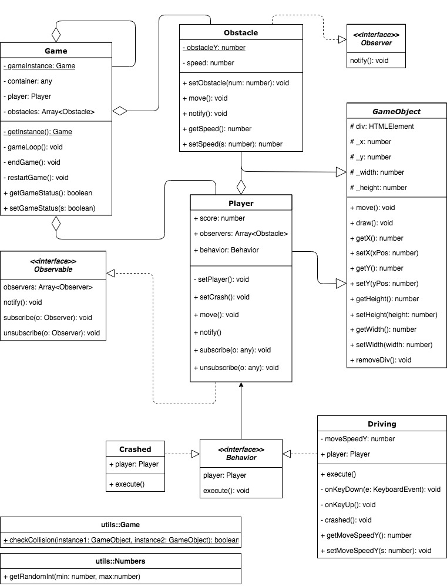

# PRG08-Typescript-Game

## Game description
In this game you are racing on the highway. Avoid as many cars as you can. One mistake means game over and you need to restart.

## Installation
To play the game locally, simply fork and download this repository and compile the code.
Open the index.html file in your browser.

## Github Pages link
[Github pages game link](https://mkmolendijk.github.io/PRG08-Typescript-Game/)

## UML Class diagram


## Pull requests
Week 4: [Pull request](https://github.com/ClikeX/typescript_game/pull/2)

Week 6: [Peer review](https://github.com/0909758/PRG08_Bobs_Nightmare/issues/6)
## Singleton
The Singleton pattern is applied at the game instance:

```
public static getInstance() {
    if (!Game.gameInstance) {
        Game.gameInstance = new Game();
    }
    return Game.gameInstance;
}
```
It is called by the following code:
```
start.addEventListener('click', function () {
    start.remove();
    Game.getInstance();
});
```

## Polymorphism
Polymorphism is applied by the 'Player' and the 'Obstacle' classes.
Those two classes extend the 'GameObject'.

gameobject.ts:
```
abstract class GameObject {
    ...
}
```

player.ts:
```
class Player extends GameObject implements Observable {
    ...
}
```

obstacle.ts:
```
class Obstacle extends GameObject implements Observer {
    ...
}
```

## Strategy pattern
The Strategy pattern is applied by creating behavior for the game objects.

behavior.ts:
```
interface Behavior {
    ...
}
```

driving.ts:
```
class Driving implements Behavior {
    ...
}
```

crashed.ts:
```
class Crashed implements Behavior {
    ...
}
```

In the code those behaviors are applied in the following way.

In player.ts:
```
this.behavior = new Driving(this);
```

In driving.ts:
```
private crashed(): void {
    this.player.behavior = new Crashed(this.player);
}
```

## Observers
The observers listen to the observable. In my case the player is the observable and the obstacles are the observables.

observable.ts:
```
interface Observable {
    observers: Array<Observer>;

    notify(): void;
    subscribe(o: Observer): void;
    unsubscribe(o: Observer): void;
}
```

observers.ts:
```
interface Observer {
    notify(): void;
}
```

If a crash occurs the player object, or the observable, notifies the oberservers to stop the game.

player.ts:
```
for (let observer of this.observers) {
    observer.notify();
}
```

obstacle.ts:
```
public notify(): void {
    this.setSpeed(0);
}
```